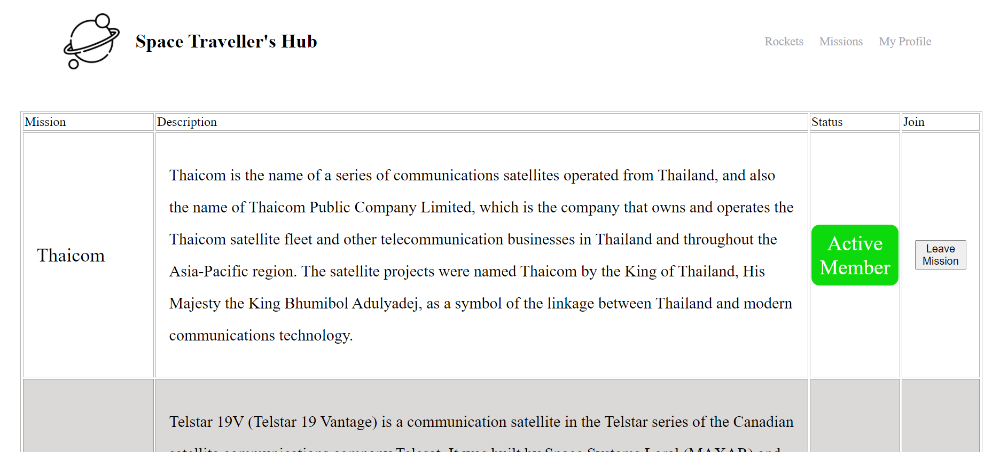

#  Space Travellers 

> This project was built using react redux to fetch 
> rockets and missions from exteranal APIs




## Built With

- React 
- React redux
- React test liberaries

## Live Link 
[LINK]('https://atoz-space.netlify.app/')
## Getting Started

**To get a copy of this repo into your local machine run the following command:**
```
git clone  https://github.com/aakbarkhan/SpaceTravelers.git
cd SpaceTravelers
in visual studio code you can click the go live button to view it live in the browser.
```


## Authors

👤 **aakbarkhan**

- GitHub: [@aakbarkhan](https://github.com/aakbarkhan)
- LinkedIn: [LinkedIn](https://www.linkedin.com/in/akuu-khan)


👤 **Zachee Ishimwe**

- GitHub: [@ishimwezachee](https://github.com/ishimwezachee)
- Twitter: [@zachee250](https://twitter.com/zachee250)


## 🤝 Contributing

Contributions, issues, and feature requests are welcome!

Feel free to check the [issues page](../../issues/).

## Show your support

Give a ⭐️ if you like this project!


## 📝 License

This project is [MIT](./MIT.md) licensed.